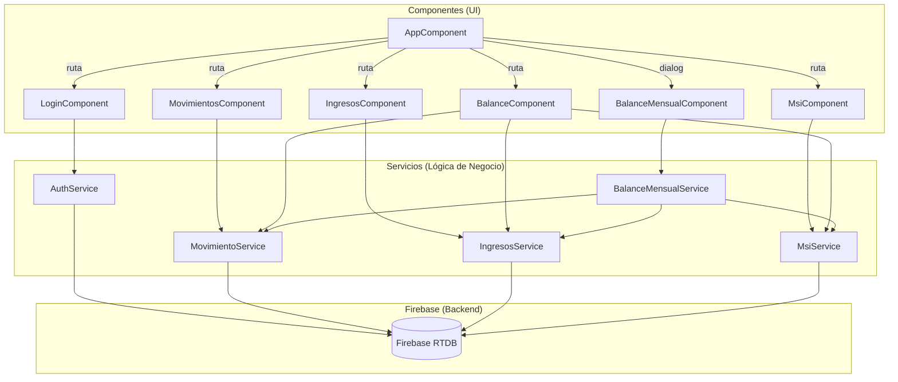
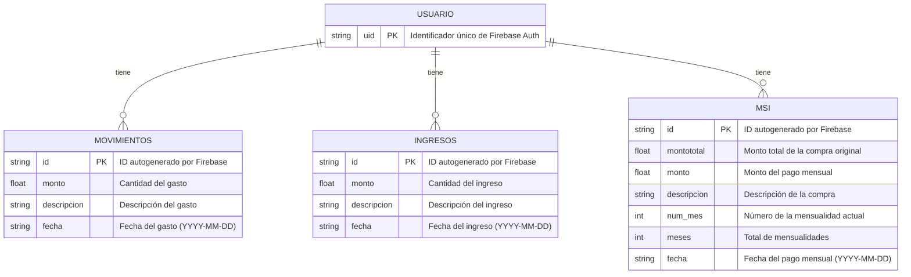
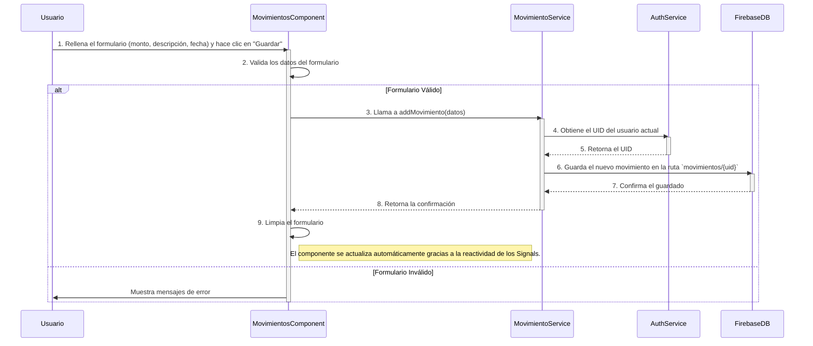

# Diagramas de Arquitectura y Flujo

Este documento contiene los diagramas que representan la arquitectura, la estructura de datos y los flujos de interacción de la aplicación "Mis Finanzas".

---

## 1. Diagrama de Componentes

Este diagrama muestra la relación entre los principales componentes y servicios de la aplicación. Ilustra cómo los componentes de la interfaz de usuario (UI) dependen de los servicios para obtener y manipular los datos.

---

## 2. Diagrama de Datos (Entidad-Relación)

Este diagrama describe la estructura de los datos almacenados en Firebase Realtime Database. La base de datos sigue un modelo NoSQL, donde los datos de cada usuario se almacenan bajo su `uid` único.

---

## 3. Diagrama de Secuencia: Agregar un Nuevo Gasto

Este diagrama detalla los pasos y las interacciones entre el usuario, los componentes y los servicios cuando se agrega un nuevo movimiento (gasto).

